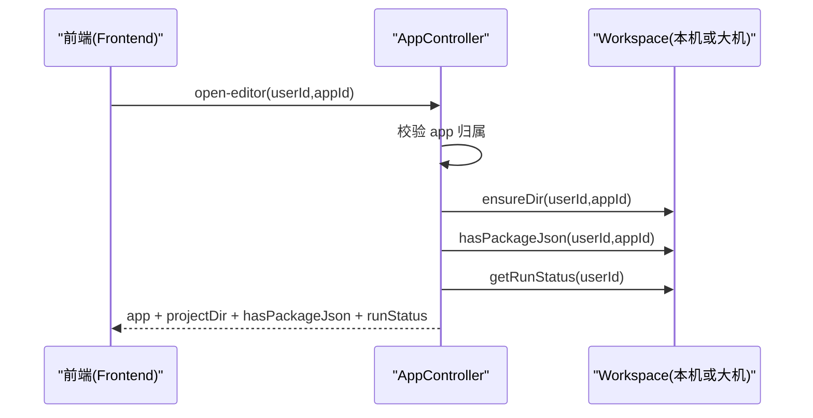

# 应用管理（App 域）

本域面向“应用元数据 + 聚合编排”：把 **App 元数据**、**Workspace 开发态（目录/运行态）**、**Deploy 部署态（可访问地址/状态对账）** 聚合到少量接口里，尽量让前端一次调用拿到“用户真正关心的信息”。

---

## 职责边界

App 域负责：

- **应用元数据 CRUD**（创建、列表、详情、更新、删除）
- **open-editor 聚合入口**：把应用元数据 + workspace 项目目录 + package.json 探测 + 当前运行态合并返回
- **部署态访问地址补齐（best-effort）**：从 Deploy Job（SUCCEEDED）推导 deployAccessUrl，并在列表/详情接口里补齐
- **状态对账（best-effort）**：如果 app 卡在 `DEPLOYING` 但 Deploy Job 已终态，会尝试回写 appStatus

不负责：

- 容器/进程实际生命周期（由 Workspace 域与 runtime-agent 承担）
- 文件读写与 zip 导入导出（由 Workspace 域承担）

---

## 核心入口

- **控制器**：`fun.ai.studio.controller.apps.FunAiAppController`
- **路由前缀**：`/api/fun-ai/app`
- **核心实体**：`fun.ai.studio.entity.FunAiApp`（表：`fun_ai_app`）

---

## 数据模型与状态机

### 1) 表：fun_ai_app（核心字段）

- **主键**：`id`
- **归属**：`user_id`
- **基础信息**：`app_name` / `app_description` / `app_type`
- **状态**：`app_status`
- **最近一次部署失败原因**：`last_deploy_error`
- **凭证**：`app_key` / `app_secret`（其中 secret 不对外返回）

### 1.1 字段长度约束（重要）

如果你在服务端日志里看到类似异常：

- `Data truncation: Data too long for column 'app_description'`

说明数据库里 `fun_ai_app.app_description` 列的类型/长度不足（常见为 `VARCHAR(255)`），但前端/调用方传入了更长的描述。

**建议处理方式：**

1) **立刻止血（接口层限制长度）**：本项目已在 `update-basic` 链路加入长度限制（配置项 `funai.app.limits.max-app-description-length`，默认 255），避免直接打出 500。

2) **根治（扩容 DB 列）**：在 MySQL 上执行以下 SQL，将 `app_description` 扩为 `TEXT`（或按需改为更大的 `VARCHAR`）：

```sql
-- 先确认当前列类型
SHOW FULL COLUMNS FROM fun_ai_app LIKE 'app_description';

-- 扩容为 TEXT（推荐：不会再触发 VARCHAR 截断）
ALTER TABLE fun_ai_app
  MODIFY COLUMN app_description TEXT NULL;
```

> 执行扩容后，如需支持更长描述，请同步把 `funai.app.limits.max-app-description-length` 提高（并建议前端也做同样限制）。

### 2) appStatus 枚举口径

`appStatus`（`fun.ai.studio.enums.FunAiAppStatus`）：

- `0`：空壳/草稿（CREATED）
- `1`：已上传/已停止（UPLOADED）
- `2`：部署中（DEPLOYING）
- `3`：可访问（READY）
- `4`：部署失败（FAILED）
- `5`：禁用（DISABLED）

> 说明：开发态的 workspace 运行态（预览/日志/进程）**不改变** `appStatus` 业务语义；它属于“last-known 视图字段”，由接口动态补齐。

---

## 关键接口（对外）

### 1) 创建应用

- `GET /api/fun-ai/app/create?userId=...`

行为（简化）：

- 校验用户存在与“每用户最大 app 数”（见配置 `funai.app.limits.max-apps-per-user`）
- 生成默认 appName（如 `未命名应用1/2/...`）
- 创建 DB 记录（**不会创建代码目录**；目录在 `open-editor` / `ensure-dir` 阶段由 Workspace 链路创建）
- best-effort：触发 Gitea 仓库创建/授权（失败不影响创建）

### 2) 应用列表 / 详情（聚合：workspace last-known + deployAccessUrl）

- `GET /api/fun-ai/app/list?userId=...`
- `GET /api/fun-ai/app/info?userId=...&appId=...`

返回的 `FunAiApp` 中会被动态补齐：

- **开发态（workspace last-known 视图）**：
  - `workspaceContainerStatus`
  - `workspaceRunState` / `workspacePreviewUrl` / `workspaceLogPath` / `workspaceLastError`
  - `workspaceHasProjectDir` / `workspaceHasPackageJson`（双机模式当前为 `null`；后续可按需做批量探测接口）
- **部署态（deploy 视图）**：
  - `deployAccessUrl`（推荐字段）
  - `accessUrl`（兼容老前端，等于 deployAccessUrl）

> 注意：为了避免前端误以为“下线后仍可访问”，只有当 `appStatus=READY` 才会返回 deployAccessUrl。

### 3) open-editor（聚合入口：目录 + package.json + runStatus）

- `POST /api/fun-ai/app/open-editor?userId=...&appId=...`

目标：让前端“打开编辑器”时一次性拿到：

- 应用元数据（含 workspace 运行态视图字段）
- workspace 的项目目录信息（host dir / container dir 等）
- 是否检测到 `package.json`（maxDepth=2）
- 当前运行态（runStatus）

典型流程（简化）：



关键约束（非常重要）：

- **open-editor 不会自动启动 dev server**：避免与终端自由命令并发导致进程错乱；“构建/预览”由前端按钮显式触发
- **双机模式**：目录与 package.json 探测在 workspace-dev（大机）完成；API（小机）不读本机磁盘
- `accessUrl` 只在“当前 run 的 appId 与本次打开的 appId 一致”时返回（避免前端拿到旧 app 的预览地址）

### 4) 修改应用基础信息

- `POST /api/fun-ai/app/update-basic`

body：`UpdateFunAiAppBasicInfoRequest`

- `userId`（必填）
- `appId`（必填）
- `appName`（同一用户下唯一）
- `appDescription`
- `appType`

### 5) 手动修正应用状态（兜底）

- `POST /api/fun-ai/app/update-status?userId=...&appId=...&appStatus=...`

仅用于异常兜底：

- 会校验应用归属
- 非 `FAILED` 状态会清空 `lastDeployError`，避免前端长期显示旧错误

### 6) 删除应用（异步清理：workspace + gitea + deploy）

- `GET /api/fun-ai/app/delete?userId=...&appId=...`

行为（简化）：

- 先删除 DB 记录（含归属校验）
- 并发触发外部清理（best-effort，失败不影响删除成功）：
  - workspace：删除 `/data/funai/workspaces/{userId}/apps/{appId}`（双机则调用 workspace-node）
  - gitea：删除仓库（若启用）
  - deploy：下线容器 + 清镜像 + 清 job/placement/last-known
- 为了稳定延迟：只等待一个短窗口（配置 `funai.app.delete.cleanup-wait-ms`），超时则后台继续跑，并在返回消息中标注“仍在后台执行”

---

## 与 Workspace / Deploy 的边界与依赖

- App 域只做“归属校验 + 聚合编排”，不直接操作 docker/podman
- Workspace 侧 `ensureDir/ensureAppDir` 也会做归属校验（双保险）
- Deploy 侧只用于“部署态访问地址”推导与“对账”，失败会降级（不会影响 list/info 主流程）


