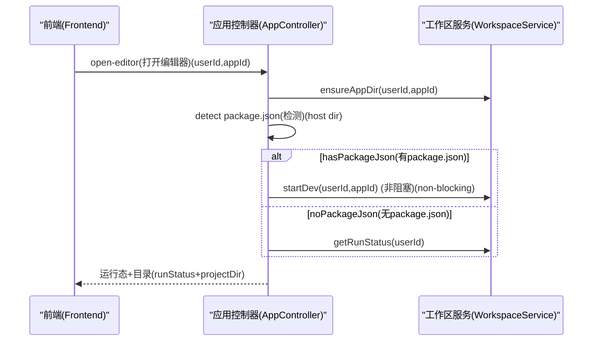

# 应用管理（App 域）

## 职责边界

应用管理负责：

- 应用的 CRUD（创建、列表、详情、更新、删除等）
- “打开在线编辑器”的聚合入口：把 **应用元数据** 与 **workspace 运行态** 串起来，尽量让前端一次调用即可进入编辑/预览

不负责：

- 具体容器创建、文件读写、运行态进程管理（这些由 Workspace 域负责）

## 核心入口

- 控制器：`fun.ai.studio.controller.apps.FunAiAppController`
- 路由前缀：`/api/fun-ai/app`

## 关键接口（高层）

### 1) 创建应用

- `GET /api/fun-ai/app/create?userId=...`

### 2) 应用列表/详情（融合 workspace last-known 运行态）

- `GET /api/fun-ai/app/list?userId=...`
- `GET /api/fun-ai/app/info?userId=...&appId=...`

接口会补充运行态字段（来自 `fun_ai_workspace_run` 的 last-known 记录），例如：

- `workspaceContainerStatus`
- `workspaceRunState`
- `workspacePreviewUrl`
- `workspaceLogPath`
- `workspaceLastError`
- `workspaceHasProjectDir`
- `workspaceHasPackageJson`

### 3) open-editor（聚合入口）

- `POST /api/fun-ai/app/open-editor?userId=...&appId=...`

典型流程（简化）：

关键约束：

- **同一 userId 同一时间只允许运行一个 app**（预览入口是应用级 `/preview/{appId}/`），open-editor 里会在必要时先 stop 旧 run，避免“看到旧应用”的错觉。

## 与 Workspace 的边界与依赖

- App 域只做“归属校验 + 聚合编排”，不直接操作 docker/容器。
- Workspace 侧会在 `ensureAppDir` 内部做应用归属校验（双保险）。

