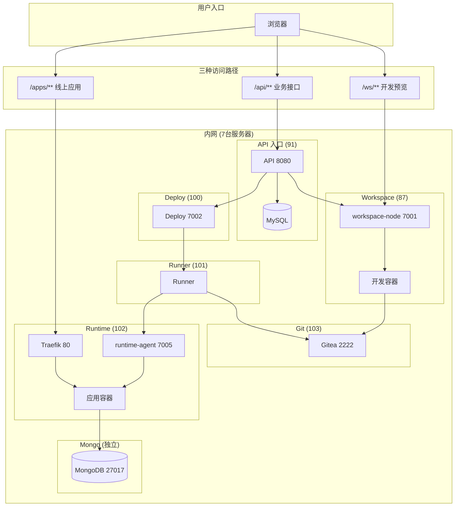
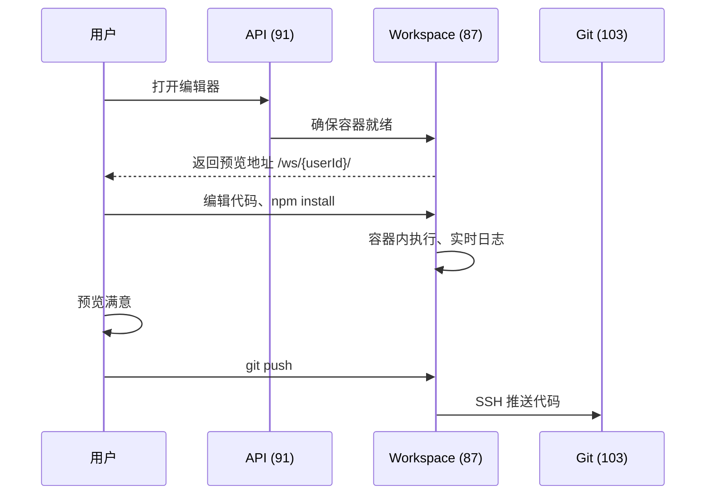
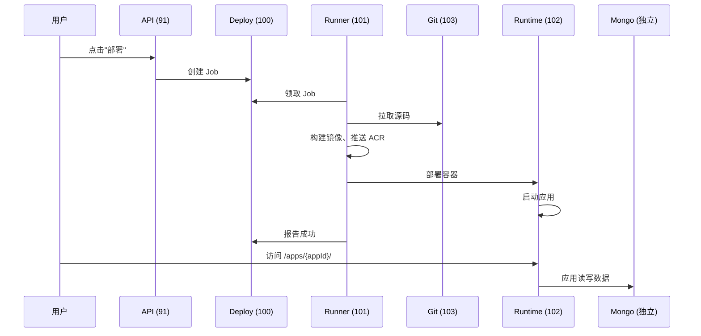
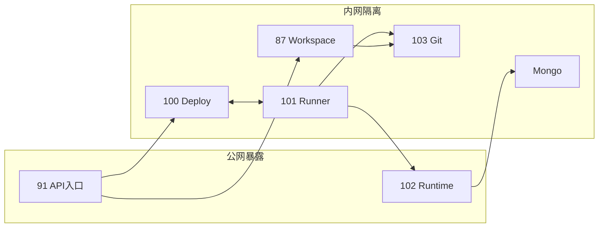

# Fun AI Studio 系统架构

## 一句话理解这个系统

Fun AI Studio 让用户 **在浏览器里写代码、实时预览、一键发布到公网**。

---

## 用户的两条路径

理解整个系统只需要记住用户会做的两件事：

```
路径 A：开发                          路径 B：发布
                                      
  打开编辑器                            点击"部署"
       ↓                                    ↓
  写代码、装依赖                        构建镜像、推送
       ↓                                    ↓
  实时预览效果                          启动线上容器
       ↓                                    ↓
  满意后提交 Git                        公网可访问
```

**所有架构设计都是为了让这两条路径顺畅运行。**

---

## 系统全景（一张图）



**一句话理解**：用户通过三条路径访问系统 —— 业务 API 走 91、开发预览走 87、线上应用走 102。

---

## 开发路径详解（路径 A）

### 发生了什么



### 关键设计

1. **每个用户一个容器** (`ws-u-{userId}`)
   - 隔离环境：你装的依赖不影响别人
   - 持久化：代码保存在宿主机，容器重建不丢失

2. **预览地址是用户级的** (`/ws/{userId}/`)
   - 不是项目级，因为同一时间只运行一个项目
   - Nginx 通过 `auth_request` 动态查端口

3. **开发态 Mongo 可选**
   - 容器内运行，仅 `127.0.0.1` 可访问
   - 纯粹为了开发方便，与线上无关

---

## 发布路径详解（路径 B）

### 发生了什么



### 关键设计

1. **控制面与执行面分离**
   - Deploy (100) 只负责"安排任务"
   - Runner (101) 负责"干活"
   - 好处：可以有多个 Runner 并行执行

2. **镜像是唯一交付物**
   - 不复制文件、不 rsync
   - Runner 构建 → 推送 ACR → Runtime 拉取运行
   - 好处：可追溯、可回滚、跨机器一致

3. **运行态 Mongo 必须独立**
   - 应用容器会被删除重建（每次部署）
   - 数据必须存在容器外
   - 一个 mongod，多库隔离：`db_{appId}`

4. **粘性落点**
   - `appId` 固定部署到某台 Runtime 节点
   - 避免每次部署换机器导致的网络/存储问题

---

## 物理架构（7 台服务器）

### 服务器清单

| 机器 | IP | 运行什么 | 核心职责 |
|------|----|----------|----------|
| **API 入口** | 91 | Nginx + API + MySQL + Prometheus | 用户唯一入口，协调所有内部服务 |
| **Workspace** | 87 | workspace-node + Nginx + Docker + Verdaccio | 承载用户开发容器 |
| **Deploy** | 100 | deploy 服务 | 发布任务调度 |
| **Runner** | 101 | runner 进程 | 构建镜像、执行部署 |
| **Runtime** | 102 | runtime-agent + Traefik + Docker | 承载用户线上应用 |
| **Git** | 103 | Gitea | 源码版本管理 |
| **Mongo** | 待定 | MongoDB | 线上应用数据库 |

### 为什么这样分



**各机器职责**：
| 机器 | 为什么单独一台 |
|------|---------------|
| 91 (API) | 大脑：所有用户请求进来，所有内部调度从这里发起 |
| 87 (Workspace) | 开发环境 CPU/内存消耗大，需要隔离 |
| 100 (Deploy) | 控制面，可独立扩容 |
| 101 (Runner) | 构建消耗资源大，可独立扩容 |
| 102 (Runtime) | 承载线上流量，可独立扩容 |
| 103 (Git) | 代码仓库需要稳定 |
| Mongo | 数据必须独立于应用容器 |

---

## 端口与通信

### 谁调用谁

**用户入口（公网）**：
| 路径 | 目标 |
|------|------|
| `/api/**` | 91:8080 (API) |
| `/ws/**` | 87:80 (Workspace) |
| `/apps/**` | 102:80 (Runtime) |

**内部调用**：
| 调用方 | 目标 | 用途 |
|--------|------|------|
| API (91) | 87:7001 | workspace 操作 |
| API (91) | 100:7002 | 创建/查询发布任务 |
| Runner (101) | 100:7002 | 领取任务、汇报结果 |
| Runner (101) | 102:7005 | 执行部署 |
| Runner (101) | 103:2222 | 拉取代码 |
| Runtime (102) | 100:7002 | 节点心跳 |
| Runtime (102) | Mongo:27017 | 应用数据 |
| Workspace (87) | 91:8080 | 节点心跳 |
| Workspace (87) | 103:2222 | 推送代码 |

### 端口速查

| 端口 | 服务 | 暴露范围 |
|------|------|----------|
| 80/443 | Nginx 入口 | 公网（91 和 102） |
| 8080 | API | 内网 |
| 7001 | workspace-node | 只允许 91 |
| 7002 | Deploy | 只允许 91/101/102 |
| 7005 | runtime-agent | 只允许 101 |
| 2222 | Git SSH | 只允许 87/101 |
| 27017 | MongoDB | 只允许 102 |

---

## 关键设计决策

### 为什么开发态和运行态要完全分开？

**问题**：开发时的预览 (`/ws/`) 和线上访问 (`/apps/`) 能不能合并？

**不能，因为**：
- 开发态容器随时可能重启、npm install、代码报错
- 线上需要稳定，不能因为用户改代码而挂掉
- 开发态数据是测试数据，线上数据是真实数据

### 为什么 Runner 和 Runtime 分开？

**问题**：能不能让 Runtime 节点自己拉代码、构建、运行？

**可以，但不好**：
- 构建时 CPU/内存消耗大，会影响正在运行的应用
- 构建依赖（docker buildx、npm）和运行依赖不同
- 分开后 Runner 可以水平扩容，不影响线上

### 为什么需要独立的 Git 服务器？

**问题**：能不能直接从 Workspace 的文件系统复制代码？

**不好，因为**：
- 文件复制不可靠（权限、路径、跨机器）
- 没有版本历史，无法回滚
- Git 是标准，所有工具链都支持

### 为什么 Mongo 要独立？

**问题**：能不能每个应用容器里跑一个 Mongo？

**不能，因为**：
- 每次部署会 `docker rm` 旧容器
- 容器内数据会丢失
- 独立 Mongo + volume 才能保证数据安全

---

## 扩容指南

### Workspace 扩容（更多用户同时开发）

```
现在：用户 ──► 91 ──► 87 (单节点)

扩容后：用户 ──► 91 ──┬──► 87-1
                      ├──► 87-2
                      └──► 87-3
```

- 新增 workspace-node 节点
- API 维护 `userId → nodeId` 映射
- 入口 Nginx 按 userId 路由

### Runtime 扩容（更多应用同时运行）

```
现在：用户 ──► 102 (单节点)

扩容后：用户 ──┬──► 102-1
              ├──► 102-2
              └──► 102-3
```

- 新增 runtime-agent 节点
- Deploy 维护 `appId → nodeId` 映射
- 统一网关负载均衡

### Runner 扩容（更快的构建）

- 新增 Runner 进程/机器
- 多个 Runner 竞争领取 Job
- 无需改配置，自动负载均衡

---

## 排障地图

遇到问题时，先定位是哪个环节：

```
用户看到的问题                 排查方向
─────────────────────────────────────────────
打不开编辑器                   91 (API) → 87 (Workspace)
预览白屏/报错                  87 容器状态、日志
部署一直 pending               100 (Deploy) → 101 (Runner)
部署失败                       101 Runner 日志、Git 连通性
线上打不开                     102 (Runtime) 容器状态、网关
线上数据丢失                   Mongo 连接、volume 挂载
```

---

## 文档索引

**子系统详解**：
- [Workspace 总览](../workspace/README.md)
- [Deploy 架构](../deploy/architecture.md)
- [Deploy 落地计划](../deploy/real-deploy-rollout.md)

**运维相关**：
- [安全组矩阵](../server/security-groups.md)
- [监控方案](../server/monitoring-minimal.md)
- [运行态 Mongo](../deploy/runtime-mongo.md)

**扩容相关**：
- [Workspace 扩容](../server/workspace-4nodes-rollout.md)
- [Runtime 扩容](../server/scaling-deploy-runtime.md)
