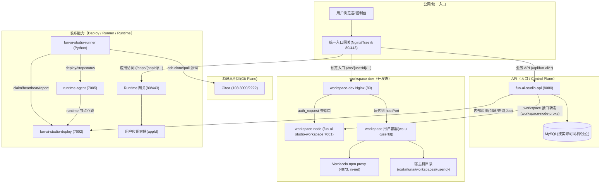
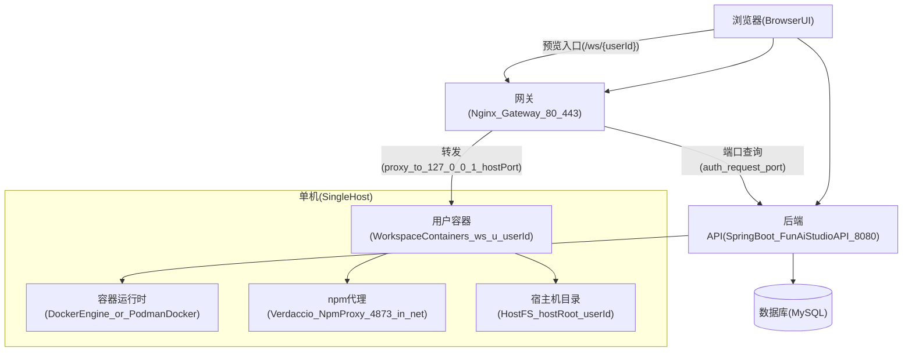
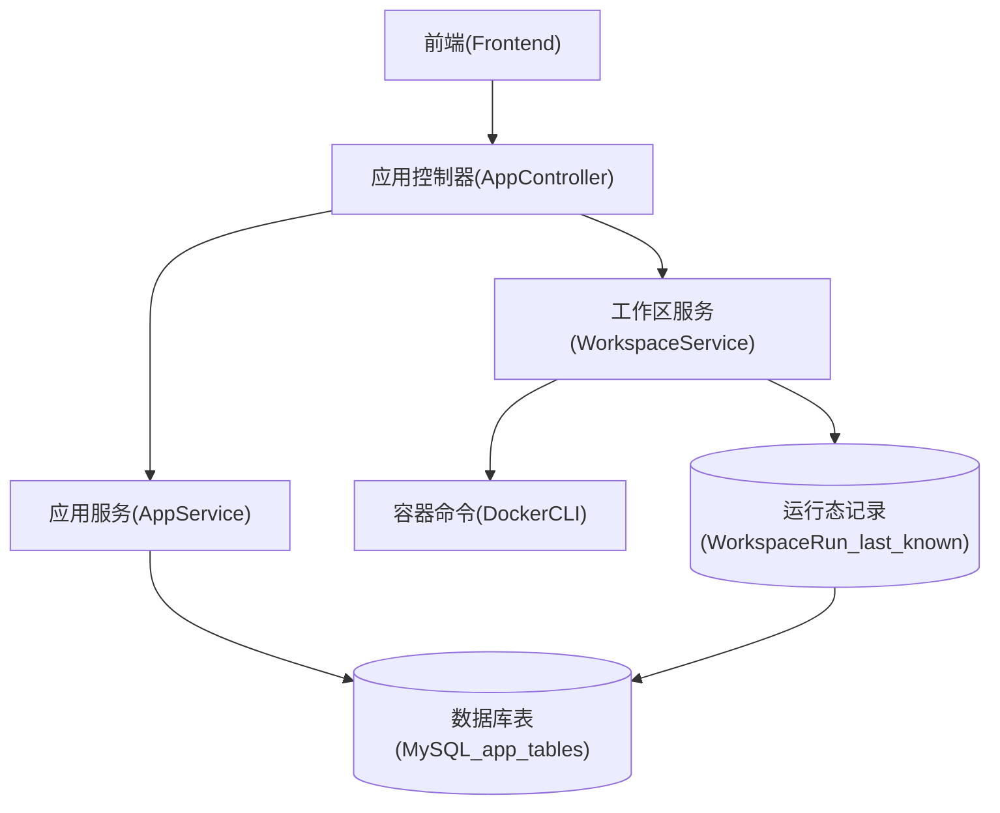
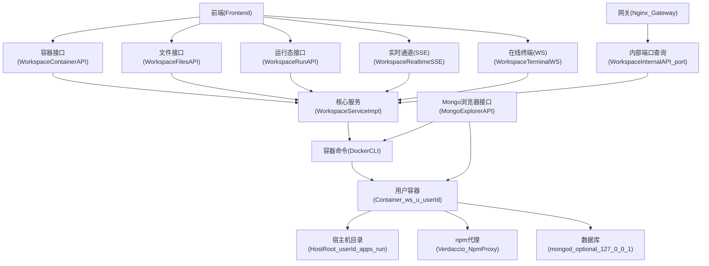
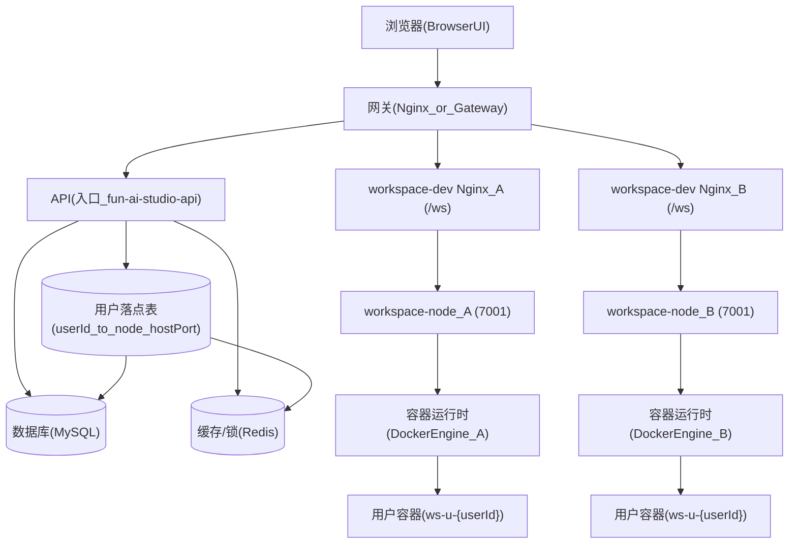
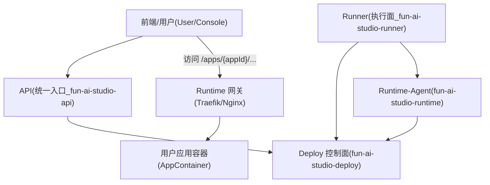
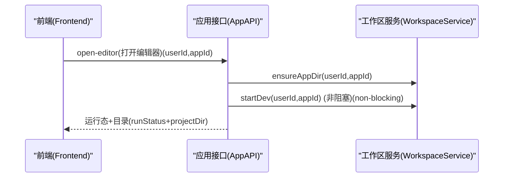
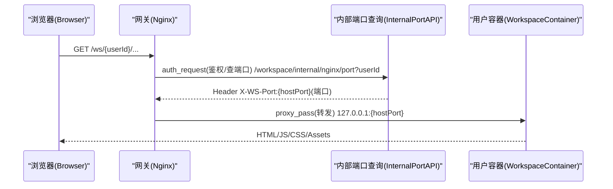
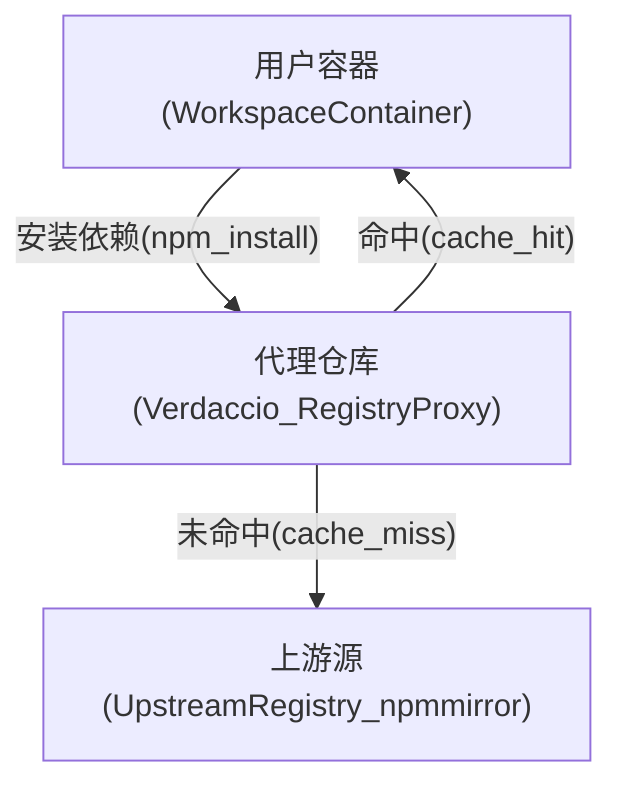
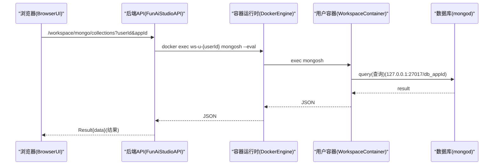

# 系统架构说明（Fun AI Studio API）

本文档提供“系统级”架构视角：**总架构图** + **各子域子架构图** + 关键链路时序图，帮助快速理解各模块组成与交互方式。

> 文档偏“架构与设计思路”，具体接口/字段细节以各域文档为准（`doc/domains/*`）。

---

## 1. 系统目标与核心体验

- **目标**：给用户提供“应用管理 + 在线开发环境（Workspace）”的一体化能力：打开编辑器、同步文件、运行预览、查看日志、在线终端、可选的容器内 Mongo。
- **体验关键**：前端尽量通过少量 API 即可进入编辑/预览；后端通过受控脚本与状态文件，保证“平台拥有最终控制权”（避免进程/端口/状态错乱）。
- **发布能力（新增）**：用户完成开发后，平台将“用户前后端一体应用”部署到 Runtime 节点（容器）并对公网统一域名下路径暴露（`/apps/{appId}/...`）。

---

## 2. 总架构图（现网 6 台为主，兼容单机/最小环境）

> 说明：你们现网已演进为 **6 台模式（API / workspace-dev / Deploy / Runner / Runtime / Git）**。  
> 本章会先给出现网总架构图，再保留“单机版”用于本地/最小环境。

### 2.1 现网 6 台模式（推荐/当前）

### 关键点（现网）

- **API 是用户唯一入口**：前端只访问 API；预览 `/ws/**` 与运行态 `/apps/**` 都由网关按路径分流。
- **workspace-dev 专注“开发态容器”**：容器/端口池/verdaccio/npm/运行日志等重负载集中在 87。
- **发布能力三件套**：Deploy（控制面）+ Runner（执行面）+ Runtime（运行态）。
- **源码真相源（Git）**：Runner 从 Git(103) 拉取源码进行构建；Workspace(87) 负责开发态编辑与 push。

---

### 2.2 单机版（本地/最小环境）

### 关键点

- **对外入口**通常由 Nginx 统一承接（只开 80/443），API 与预览 `/ws/{userId}/` 都通过反代完成。
- **Workspace 容器**由后端通过 `docker` CLI 管理（`run/exec/inspect/stop`）。
- **npm-cache** 使用 Verdaccio（同机容器网络访问）减少出网、提升 install 稳定性与速度。

---

## 3. 各子域子架构图（按域拆分）

### 3.1 App 域子架构图（应用管理 + open-editor 聚合编排）

说明（配合图看）：

- App 域负责 **应用 CRUD** 与 **open-editor 聚合编排**，Workspace 域负责容器/文件/运行态等底层能力。

### 3.2 Workspace 域子架构图（容器/文件/运行态/实时/internal/npm-cache/Mongo）

说明（配合图看）：

- **container 子系统**：ensure/status/heartbeat（保证容器与挂载就绪）
- **files 子系统**：宿主机落盘，容器通过 bind mount 可见
- **run 子系统**：受控任务（dev/preview/build/install）+ `current.json`/日志
- **realtime 子系统**：SSE（状态/日志增量）+ WS 终端（docker exec）
- **internal 子系统**：Nginx `auth_request` 查 `userId -> hostPort`（无副作用）
- **npm-cache**：通过 `funai-net` 访问 Verdaccio
- **Mongo（可选）**：容器内 `mongod`；Mongo Explorer 通过后端 `docker exec mongosh` 只读查询

### 3.3 Server 域子架构图（多机扩容：ControlPlane + WorkspaceNode）

说明（配合图看）：

- 扩容关键是把 **userId 落点（nodeId/hostPort）** 存起来，并让 Gateway 能按 userId 路由到正确的 WorkspaceNode。

### 3.4 Deploy 域子架构图（控制面 / Runner / Runtime）

说明（配合图看）：

- **用户只访问 API**：API 负责鉴权与入口编排，内部调用 Deploy 创建/查询 Job。
- **Deploy 不执行用户代码**：Deploy 只负责任务编排与记录（控制面），执行动作由 Runner 完成（执行面）。
- **Runtime 对外暴露统一入口**：用户应用最终跑在 Runtime 节点的容器里，通过网关统一域名下按路径访问。

深入阅读：

- `doc/domains/deploy/README.md`（API 入口与调用链）
- `doc/domains/deploy/architecture.md`（整体架构与互联矩阵/运维视角）

---

## 4. 关键链路（时序图）

### 4.1 open-editor（前端进入编辑器的一次性编排）

### 4.2 /ws/{userId}/ 预览反代（Nginx auth_request + 端口映射）

### 4.3 npm-cache（Verdaccio 代理仓库）

### 4.4 Mongo Explorer（不暴露端口的只读代理）

---

## 5. 文档索引（按域深入）

- `doc/domains/app/README.md`
- `doc/domains/workspace/README.md`
- `doc/domains/deploy/README.md`
- `doc/domains/server/scaling-workspace.md`

