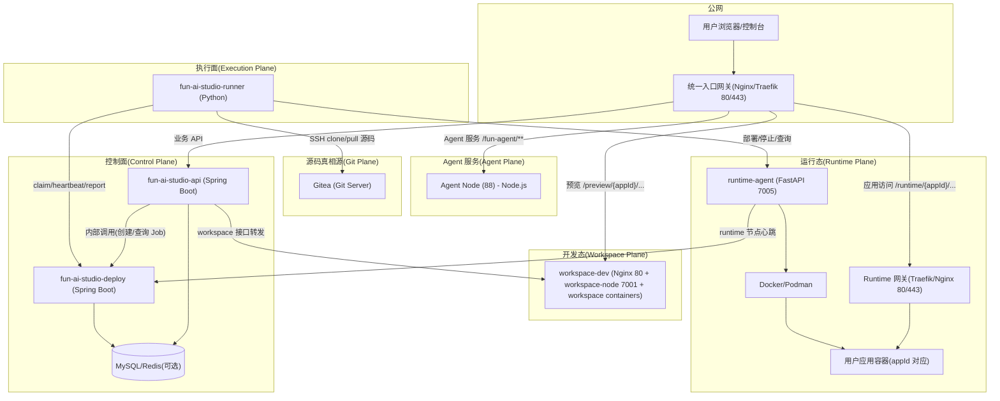
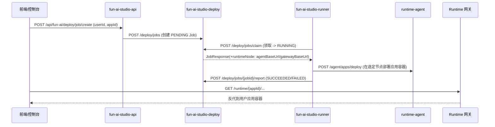
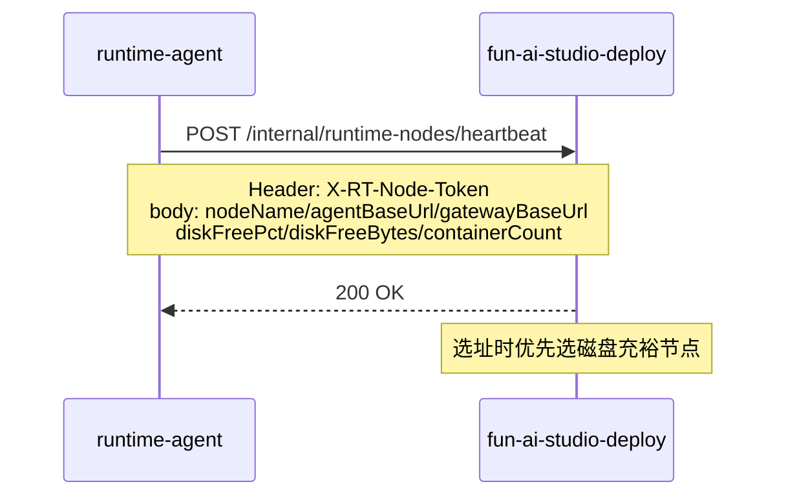

# Deploy / Runner / Runtime（整体架构与互联矩阵）

本文档面向“研发 + 运维”，用一页说明清楚：

- 整体架构（控制面 / 执行面 / 运行态）
- 三个工程（`api` / `deploy` / `workspace`）+ 两个 Python 进程（Runner / Runtime-Agent）各自职责
- 关键调用链、端口与鉴权矩阵
- 最小联调与排障自检清单

> 详细的 Job 队列与 Runtime Node Registry 设计见 deploy 工程内置文档（Deploy 控制面）：  
> - `fun-ai-studio-deploy/src/main/resources/doc/domains/job/job-queue.md`  
> - `fun-ai-studio-deploy/src/main/resources/doc/domains/runtime/runtime-nodes.md`

---

## 1. 总体架构（现网 7 台：API / Agent / workspace-dev / Deploy / Runner / Runtime / Git）

> 说明：Deploy/Runner/Runtime 属于"发布能力"的 3 件套；workspace-dev 属于"开发态容器节点"；Agent Node 为前端 Agent 服务节点。  
> 本文聚焦发布能力互联矩阵，但会在总览图中把 workspace-dev 和 Agent Node 放出来，避免与现网口径冲突。

一句话记忆：

- **API（入口）**：用户/前端只打 API，API 负责鉴权与业务入口编排，然后内部调用 Deploy 控制面创建 Job
- **Deploy（控制面）**：决定“做什么、由谁做、做到哪台 Runtime 上”，维护 Job 状态与 runtime 节点注册表/选址
- **Runner（执行面）**：领取 Job，把构建/部署动作真正做完（构建镜像、推送、调用 Runtime-Agent 部署），再回传结果
- **Runtime（运行态）**：真正承载用户应用容器，对外统一域名下路径路由（`/runtime/{appId}/...`）

---

## 2. 项目/进程职责边界（你们现在的 3+2 组件）

### 2.1 `fun-ai-studio-api`（用户唯一入口）

- 面向用户/前端的业务 API：应用管理、workspace 开发入口、部署入口
- 内部调用：
  - 调用 Deploy 创建/查询/列举 Job（`deploy-proxy.*` 配置）
  - 接收 workspace-node 心跳/注册（`funai.workspace-node-registry.*` 配置）

### 2.2 `fun-ai-studio-deploy`（Deploy 控制面）

- Job 队列：`PENDING -> RUNNING -> SUCCEEDED/FAILED/CANCELLED`
- Runner 协议：`claim / heartbeat / report`（HTTP polling）
- Runtime Node Registry：runtime-agent 定时 heartbeat，上报 `agentBaseUrl`、`gatewayBaseUrl`、**磁盘水位**（`diskFreePct/diskFreeBytes`）、**容器数**（`containerCount`）
- Placement（选址）：`appId -> runtimeNode` **粘性落点** + **磁盘水位优先调度**（`disk-aware` 策略）
  - 硬阈值过滤：`diskFreePct >= 15%`（低于此值节点不可选）
  - 选 `diskFreePct` 最大的节点（避免单节点磁盘打满）
  - 已有 placement 不变（避免频繁迁移）
  - 支持 InMemory/DB 落库切换；生产建议落库避免 Deploy 重启丢数据
  - 详见：[Runtime 节点磁盘水位调度与扩容](../server/scaling-deploy-runtime.md#6-runtime-节点磁盘水位调度与扩容到-3-台推荐生产策略)

### 2.3 `fun-ai-studio-workspace`（Workspace 节点服务）

- workspace-node：承载“开发环境容器/预览/终端/文件”等重负载能力
- 向 API 汇报心跳，便于 API 做节点健康过滤、manual-drain/迁移等运维动作

### 2.4 `fun-ai-studio-runner`（Python Runner）

- 轮询 Deploy 控制面领取 Job：`POST /deploy/jobs/claim`
- 处理执行：构建/推送镜像（后续可用 `docker buildx build --push`）、调用 runtime-agent 部署
- 续租：`POST /deploy/jobs/{jobId}/heartbeat`
- 回传：`POST /deploy/jobs/{jobId}/report`

### 2.5 `fun-ai-studio-runtime`（Python Runtime-Agent）

- 对 Runner 暴露内部 API：`/agent/apps/deploy`、`/agent/apps/stop`、`/agent/apps/status`
- 在本机 Docker 上管理“用户应用容器”
- 对 Deploy 控制面上报节点心跳（Runtime Node Registry）
- 配合网关（建议 Traefik）实现统一域名下 `/runtime/{appId}/...` 的路径路由

---

## 3. 关键链路（端到端）

### 3.1 用户点击“部署”（用户只访问 API）

### 3.2 Runtime 节点注册与健康判断（心跳）

---

## 4. 端口与鉴权矩阵（运维最常用）

> 下面只列“关键互联端口”；Workspace 的端口/网关细节见 `doc/domains/server/workspace-node.md`。

### 4.1 端口（默认约定）

- **API**：`8080`（对前端/网关；生产通常只让网关访问）
- **Agent Node**：`80`（内网 88；仅允许 91 转发，承载 `/fun-agent/**`）
- **Deploy**：`7002`（内网；API/Runner/Runtime-Agent 访问）
- **workspace-node**：`7001`（内网；API/节点本机 Nginx 访问）
- **runtime-agent**：`7005`（内网；Runner 访问）
- **Runtime 网关**：`80/443`（公网统一入口，承载 `/runtime/{appId}`）

### 4.2 鉴权（Header / Secret / IP allowlist）

- **workspace-node -> API 心跳**：
  - API 接口：`POST /api/fun-ai/admin/workspace-nodes/heartbeat`
  - Header：`X-WS-Node-Token: <token>`
  - API 配置：`funai.workspace-node-registry.shared-secret`、`funai.workspace-node-registry.allowed-ips`
- **runtime-agent -> Deploy 心跳**：
  - Deploy 接口：`POST /internal/runtime-nodes/heartbeat`
  - Header：`X-RT-Node-Token: <secret>`
  - Deploy 配置：`deploy.runtime-node-registry.shared-secret`、`deploy.runtime-node-registry.allowed-ips`
- **Deploy 运维接口（admin）**：
  - Header：`X-Admin-Token: <adminToken>`
  - Deploy 配置：`deploy.admin.token`、`deploy.admin.allowed-ips`
- **Runner -> runtime-agent**：
  - runtime-agent Header：`X-Runtime-Token: <token>`
  - runtime-agent 环境变量：`RUNTIME_AGENT_TOKEN`
- **API -> Deploy 内部调用（预留）**：
  - API 配置：`deploy-proxy.shared-secret`（当前为预留字段，待 Deploy 增加 internal auth 后启用）

---

## 5. 最小联调（只验证链路，不涉及 buildx/镜像仓库）

### 5.1 验证 Runtime 节点心跳可见（Deploy）

1) runtime-agent 上报心跳：

- `POST http://<deploy-host>:7002/internal/runtime-nodes/heartbeat`
- Header：`X-RT-Node-Token: <deploy.runtime-node-registry.shared-secret>`
- body（示例）：
  - `nodeName=rt-node-01`
  - `agentBaseUrl=http://<rt-node>:7005`
  - `gatewayBaseUrl=https://<public-runtime-gateway>`

2) Deploy 侧查询节点列表（admin）：

- `GET http://<deploy-host>:7002/admin/runtime-nodes/list`
- Header：`X-Admin-Token: <deploy.admin.token>`

### 5.2 验证 Job 创建 → Runner claim → report

1) 通过 API 创建 Job（用户入口）：

- `POST http://<api-host>:8080/api/fun-ai/deploy/job/create?userId=...&appId=...`

2) Runner 启动后观察：

- claim 拿到 `runtimeNode.agentBaseUrl/gatewayBaseUrl`
- 执行完成后 report 为 `SUCCEEDED/FAILED`

---

## 6. 排障自检清单（运维视角）

- **Deploy 健康检查**：`GET /internal/health`（Deploy 服务）
- **API 健康检查**：按你们现有 health/监控方式
- **runtime-agent 健康检查**：`GET /internal/health`
- **节点“看起来在线但不可用”**：
  - runtime-agent 心跳是否持续（stale 阈值：`deploy.runtime-node-registry.heartbeat-stale-seconds`）
  - Runner 是否能访问 `agentBaseUrl`（安全组/内网 DNS/防火墙）
- **Job 一直 PENDING**：
  - Runner 是否在跑（进程/容器）
  - Runner 是否能访问 Deploy（7002）
- **Job RUNNING 卡住**：
  - heartbeat 是否在续租（leaseSeconds 与心跳周期）
  - runtime-agent 是否能创建/更新容器（Docker 权限、network、镜像仓库）

