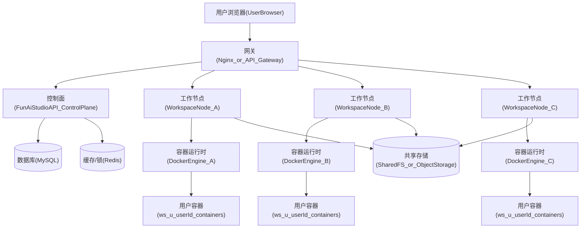

# 多机扩容方案（面向 Workspace）

## 现状（单机版假设）

当前工程的 Workspace 能力在单机上成立的关键假设：

- **每用户一个容器**：容器名 `ws-u-{userId}`，并通过 `docker` CLI 进行 `run/exec/inspect/stop`。
- **预览入口是用户级**：`/ws/{userId}/`（Nginx 反代到该用户固定 `hostPort`）。
- **宿主机持久化目录**：`{hostRoot}/{userId}/...` bind mount 到容器 `/workspace`。
- **实时链路**：
  - SSE 与 WS 终端会持续 `touch(userId)`，影响 idle 回收策略（这在多机依然成立，只是 `touch` 的存储位置需要从内存迁移到共享存储）。

这意味着：多机扩容的核心难点不在 Spring Boot，而在 **“/ws/{userId} 的路由与 state（容器/端口/目录）绑定在某一台机器”**。

---

## 目标与原则

- **目标**：支持多台服务器扩容（更多 Workspace 节点承载更多用户容器），对外仍然是一个统一域名入口。
- **原则**：
  - 先做 **最小可行的多机**（不引入 Kubernetes 也能跑）。
  - 逐步把“单机内存态/本机路径假设”迁移到共享能力（DB/Redis/对象存储/共享盘）。
  - 把 Workspace 节点当成 **可横向扩展的计算节点**，API 当成 **控制面**（control plane）。

---

## 推荐总体架构（两层：Gateway + ControlPlane + WorkspaceNode）

### 职责划分

- **Gateway（统一入口）**
  - 负责静态资源、API 反代、以及 **/ws/{userId}/ 预览流量路由**。
  - 推荐继续使用 Nginx（你们已有 `auth_request` 设计）。

- **ControlPlane（Spring Boot API）**
  - 负责鉴权、业务数据（MySQL）、以及 “用户 → 节点/容器/端口” 的 **调度与状态维护**。
  - 不再假设容器都在本机；而是通过“节点代理”去执行容器操作。

- **WorkspaceNode（计算节点）**
  - 跑 Docker（或 Podman-docker）。
  - 负责本机容器生命周期（create/start/exec/stop/metrics）。
  - 负责挂载持久化（本机盘 / NFS / 对象存储同步策略）。

---

## 关键设计：/ws/{userId}/ 的路由与“用户落点（Placement）”

### 必须引入一个“用户落点表”

对每个 userId 记录：

- `nodeId`（或 nodeHost）
- `hostPort`（该用户容器映射到节点的宿主端口）
- `containerName`（`ws-u-{userId}`，或将来可扩展）
- `lastActiveAt`（用于 idle 回收）

存储位置建议：

- **MySQL（权威）**：用于持久化与审计
- **Redis（热缓存 + 分布式锁）**：用于快速路由/调度与防并发（同一用户同时 ensure/run 的竞态）

### Gateway 路由策略（推荐两种）

#### 策略 A（推荐）：Gateway 动态转发到 WorkspaceNode（按 userId 查表）

1. 用户访问 `https://your-domain/ws/{userId}/...`
2. Gateway 子请求 `auth_request` 到 ControlPlane，拿到该 userId 的 `nodeUpstream`（或在 header 中返回）
3. Gateway 按 header 选择 upstream 转发到对应 WorkspaceNode，再由 WorkspaceNode 反代到本机容器 `hostPort`

优点：

- 对外仍是一个域名
- /ws 流量不必穿过 ControlPlane（减少 Java 压力）

#### 策略 B（简化版）：ControlPlane 302 跳转到节点域名

把预览域名做成 `ws-nodeA.example.com` 这类，ControlPlane 返回跳转 URL。

优点：实现简单；缺点：多域名/证书/跨域体验更复杂。

---

## WorkspaceNode 的实现形态（不引入 K8s）

### 方案 1（推荐起步）：WorkspaceNode 作为“轻代理服务”

每个节点跑一个轻量 HTTP 服务（可以是：
Java/Spring Boot 子进程、Go、Node、甚至一个非常薄的 Spring Boot 模块），对外只暴露内网端口，提供：

- `POST /node/container/ensure?userId=...`
- `GET /node/container/status?userId=...`
- `POST /node/run/start?userId&appId...`（可选：也可让 ControlPlane 直接调 Docker CLI，但不建议）
- `POST /node/container/stop?userId=...`
- `GET /node/metrics`（可选）

ControlPlane 通过这些 API 完成“跨机”容器操作。

优点：

- 复用你们现有的 docker CLI 思路
- 不需要开放 Docker Remote API（安全风险更低）

### 方案 2：开放 Docker Remote API（不推荐）

除非你有成熟的 mTLS、网络隔离、鉴权，否则不建议直接暴露 Docker API。

---

## 存储：hostRoot 如何在多机下成立

你们当前的 `{hostRoot}/{userId}/...` 是**节点本地路径**。多机时有两条路线：

### 路线 A（推荐起步）：用户“粘性”落在某个节点，本地盘持久化

- userId 一旦被调度到 NodeA，默认长期留在 NodeA（除非迁移）。
- 优点：性能最好，改动最小
- 缺点：节点故障时该节点用户不可用；扩容/缩容需要“用户迁移”

配套需要：

- MySQL/Redis 里保存 `userId -> nodeId`
- Gateway 路由到该 node
- 迁移工具（后续再做）

### 路线 B：共享文件系统（NFS/CephFS/EFS 等）

- 所有 WorkspaceNode 通过同一挂载点访问 `{hostRoot}`
- 优点：用户可在任意节点拉起容器（更容易调度/迁移）
- 风险：IO 性能与一致性、成本；NFS 断链会导致容器/编辑器异常

### 路线 C：对象存储（S3/OSS）+ 同步（适合“文件域”而非实时开发）

更适合 build 产物/导入导出，而不是编辑器实时读写。

---

## 调度与扩容步骤（推荐分阶段落地）

### Phase 0：单机加固（你们刚做完一部分）

- 容器资源限制（memory/cpu/pids）
- mongod cache 限制（wiredTiger）
- 继续保留单机目录与端口分配逻辑

### Phase 1：先拆“控制面 vs 工作节点”（2 台机即可）

- ControlPlane（Spring Boot API）+ MySQL + Redis：放一台（或托管）
- WorkspaceNode：另一台（只跑 docker + node agent + nginx/workspace 反代）
- 引入 `userId -> nodeId/hostPort` 的持久化表（MySQL）与缓存（Redis）
- Gateway：放在 ControlPlane 或独立一台（对外只开 80/443）

### Phase 2：WorkspaceNode 横向扩容（N 台）

关键能力补齐：

- 调度策略：按节点负载/可用端口/容器数/内存余量选择 node
- 幂等：同一 userId 并发 ensure 只会落一次（Redis 锁）
- 健康检查：节点失联时避免路由过去

### Phase 3：可靠性与运维

- Redis 做 `lastActiveAt` 与分布式锁；MySQL 做最终一致
- 观测：节点容器数、内存、CPU、磁盘、端口占用
- 备份：MySQL 备份、workspace 数据（按路线 A/B）

---

## 迁移清单（从单机到多机你需要改哪里）

> 本节是“未来要改代码”的定位点，先写在方案里，便于后续实现时对照。

- **Workspace 状态存储从内存迁移**：`WorkspaceActivityTracker` 目前是 JVM 内存，需要迁移到 Redis（多实例一致）。
- **容器操作从本机 docker CLI 迁移到 Node 代理**：`FunAiWorkspaceServiceImpl` 中所有 `docker(...)` 调用需要能“指定 node”。
- **预览路由依赖 hostPort**：多机下 `previewUrl` 需要包含 node（或经 Gateway 间接路由）。

---

## 推荐你现在就采用的最小方案（结合你现状：一台机，后续扩容）

- 立刻把 **MySQL** 迁到独立实例/托管（或至少独立机器），因为它是最难扩的单点。
- 预留 **Redis**（哪怕先单实例），用于未来多机的 session/cache/lock/lastActiveAt。
- 未来新增 WorkspaceNode 时采用“路线 A（用户粘性落点 + 本地盘）”，先把扩容跑通；等用户量上来再评估共享盘/迁移工具。

