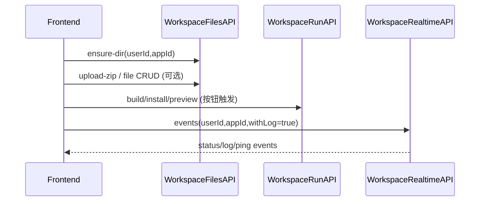

# Workspace 总览（在线开发环境域）

Workspace 域的目标：给每个用户提供一个可持久化的“在线开发容器”，支持：

- 项目文件同步（宿主机落盘 + 容器可见）
- 容器内运行 dev server（Vite/Node）
- 实时日志/状态（SSE）
- 在线终端（WebSocket + docker exec）
- 依赖安装加速（npm 缓存/后续私有仓库）

## 核心约束（单机版）

- **每个用户一个容器**：容器名 `ws-u-{userId}`（可配置前缀）
- **每个用户同一时间仅运行一个 app**：切换 app 时会 stop 旧 run
- **预览入口是用户级**：`/ws/{userId}/`（Nginx 反代到该用户固定 hostPort）
- **宿主机持久化目录**：`{hostRoot}/{userId}/...` 挂载到容器 `containerWorkdir`（默认 `/workspace`）
  - 宿主机：`{hostRoot}/{userId}/apps/{appId}` <-> 容器：`/workspace/apps/{appId}`
  - 宿主机：`{hostRoot}/{userId}/run` <-> 容器：`/workspace/run`

## 目录/组件定位

- 主要配置：`fun.ai.studio.workspace.WorkspaceProperties`
- 核心服务：`fun.ai.studio.service.impl.FunAiWorkspaceServiceImpl`
- 控制器（按子域拆分）：
  - 容器级：`fun.ai.studio.controller.workspace.container.FunAiWorkspaceContainerController`
  - 文件域：`fun.ai.studio.controller.workspace.files.FunAiWorkspaceFileController`
  - 运行态：`fun.ai.studio.controller.workspace.run.FunAiWorkspaceRunController`
  - internal：`fun.ai.studio.controller.workspace.internal.FunAiWorkspaceInternalController`
  - SSE：`fun.ai.studio.controller.workspace.realtime.FunAiWorkspaceRealtimeController`
  - WebSocket 终端：`fun.ai.studio.workspace.realtime.WorkspaceTerminalWebSocketHandler`

## 常用增强能力

- [npm 缓存（最简方案）](./npm-cache.md)

## 典型链路（在线编辑器进入）

