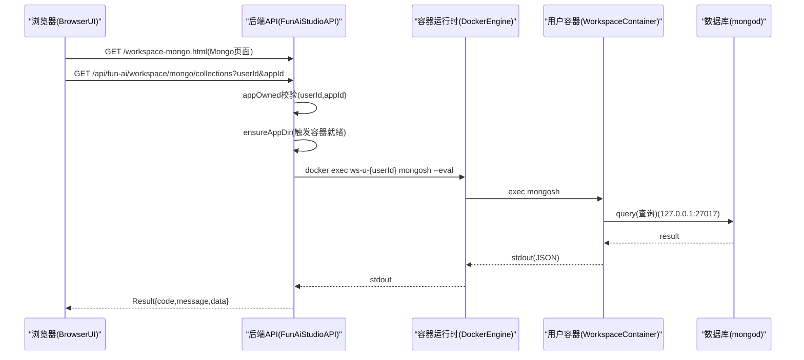

# Workspace：Mongo Explorer（Web，只读）

## 目标

在不暴露 Mongo 端口（27017）、不改变 `bindIp=127.0.0.1` 安全模型的前提下，为用户提供一个 **Web 可视化** 的 Mongo 浏览/查询能力（V1：只读）。

## 核心设计

- **不在容器内再起一个 Web 管理服务**（避免每用户额外常驻进程、端口管理、升级与漏洞放大）。
- **不在云端直接连接 Mongo**（避免改为对外暴露/网络打通带来的多租户安全风险）。
- 采用 **平台后端受控代理**：
  - 后端通过 `docker exec` 进入用户容器
  - 调用容器内 `mongosh` 连接 `mongodb://127.0.0.1:27017/{dbName}`
  - 输出 JSON（EJSON relaxed）返回给前端页面展示

## 数据隔离与访问边界

- **用户级**：每用户一个 workspace 容器（`ws-u-{userId}`），Mongo 默认仅容器内可访问
- **项目级（db 隔离）**：强制只访问
  - `dbName = {dbNamePrefix}{appId}`（默认 `db_{appId}`）
- **运行态前置（关键约束）**：必须先对该 app 点击 **preview**，且运行态为 `RUNNING + type=START` 才允许访问数据库
- **只读**：V1 仅提供
  - 列出集合（collections）
  - 查询列表（find）
  - 按 `_id` 查询单条（doc）
- **不接受任意 JS**：后端只接收结构化参数（collection/filter/projection/sort/limit/skip），由后端拼固定模板 `mongosh --eval` 脚本执行。

## 架构与调用链路

## 代码位置（后端）

- **Controller**：`src/main/java/fun/ai/studio/controller/workspace/mongo/FunAiWorkspaceMongoController.java`
  - `GET /api/fun-ai/workspace/mongo/collections`
  - `POST /api/fun-ai/workspace/mongo/find`
  - `GET /api/fun-ai/workspace/mongo/doc`
- **mongosh 执行封装**：`src/main/java/fun/ai/studio/workspace/mongo/WorkspaceMongoShellClient.java`
  - 负责 `docker exec`、`mongosh --quiet --eval`、JSON 解析、参数边界控制
- **请求/响应 DTO**
  - `src/main/java/fun/ai/studio/entity/request/WorkspaceMongoFindRequest.java`
  - `src/main/java/fun/ai/studio/entity/response/WorkspaceMongoCollectionsResponse.java`
  - `src/main/java/fun/ai/studio/entity/response/WorkspaceMongoFindResponse.java`
  - `src/main/java/fun/ai/studio/entity/response/WorkspaceMongoDocResponse.java`

## UI（本工程静态页面）

- **页面文件**：`src/main/resources/static/workspace-mongo.html`
- **访问路径**：`/workspace-mongo.html`
- **鉴权策略**：
  - 页面本身放入白名单（便于直接打开）
  - API 仍走 JWT 鉴权

### 推荐使用方式（URL 注入参数）

为了对新手更友好，页面支持从 URL 自动注入 `userId/appId/token(auth)`，无需手动粘贴输入框。

- **推荐（更安全）**：`userId/appId` 放 query，`token` 放 hash（不会出现在 queryString，也更不容易被网关/access log 记录）

`/workspace-mongo.html?userId=10000021&appId=20000086#token=Bearer%20<JWT>`

- **也支持**：使用 `auth` 参数名（等价于 token）

`/workspace-mongo.html?userId=10000021&appId=20000086#auth=Bearer%20<JWT>`

说明：

- token 里有空格（`Bearer `），需要写成 `Bearer%20`
- 如果你只传纯 JWT（不带 `Bearer `），页面会自动补 `Bearer `
- 如果 URL 同时注入了 `userId+appId+token/auth`，页面会自动填入并锁定输入，直接点击“加载集合”即可

## 运行前置条件

- 已启用 workspace mongo：`funai.workspace.mongo.enabled=true`
- workspace 镜像内包含 `mongod` 与 **Mongo Shell 工具链**
  - 推荐：`mongosh`
  - 兼容兜底：`mongo`（旧版 shell，能力可能受限）
  - 若两者都缺失，API 会返回明确错误提示

### 如何在容器里快速验证

进入对应用户容器执行：

- `command -v mongosh || echo mongosh_not_found`
- `command -v mongo || echo mongo_not_found`

### 镜像构建时安装建议（示例）

不同基础镜像/发行版包名可能不同，但目标是：最终容器里存在 `mongosh` 命令。

- Debian/Ubuntu 常见方式（示例）：
  - `apt-get update && apt-get install -y mongodb-mongosh`（或 `mongosh`）

## 安全与限流策略（V1）

- **集合名白名单校验**：只允许 `A-Z a-z 0-9 _ . -` 等安全字符；禁止 `system.*`
- **分页边界**：`limit <= 200`，`skip <= 10000`
- **查询超时**：`maxTimeMS=3000`
- **输出截断提示**：后端命令输出最大约 32KB；若结果过大将解析失败并提示降低 `limit`/使用 `projection`

## 常见问题（排错）

1. 返回“Workspace Mongo 未启用”
   - 检查配置 `funai.workspace.mongo.enabled=true`
2. 返回“容器镜像未包含 mongosh”
   - 更换 workspace image（包含 `mongosh/mongod`）
3. 返回“mongosh 执行失败 / 无输出”
   - 进入容器查看 `mongod` 是否启动、查看 `{containerLogDir}/{logFileName}` 日志

## 资源占用提示（重要）

MongoDB（WiredTiger）默认会根据可用内存估算较大的 cache（常见约 50%），在 2GiB 机器上会导致“常态内存占用很高”。\n
建议在生产环境显式设置：

- `funai.workspace.mongo.wiredTigerCacheSizeGB=0.25`（约 256MB，2GiB 机器推荐起点）

该配置会注入到容器内 mongod 启动参数：`--wiredTigerCacheSizeGB`。

